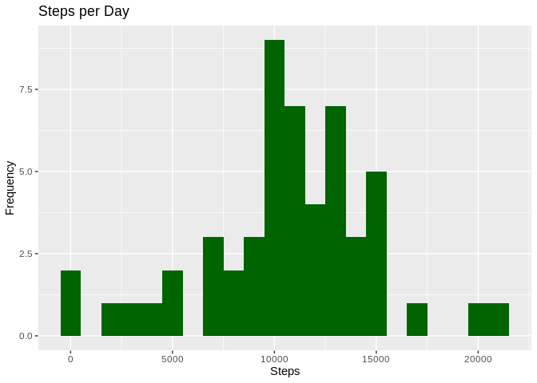
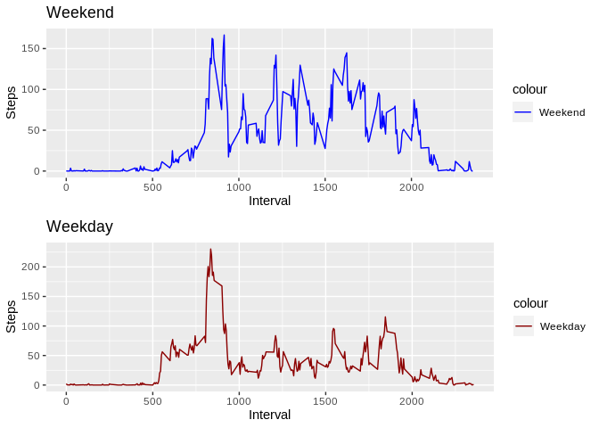

## Loading and preprocessing the data
This document will contain the code and results of a simple analysis of a dataset that recorded how many steps were taken in 5 minute intervals over two months.

The first code section below loads the necessary packages we will need, as well as loads the dataset from the working directory.


```r
library(tidyr)
library(dplyr)
```

```
## 
## Attaching package: 'dplyr'
```

```
## The following objects are masked from 'package:stats':
## 
##     filter, lag
```

```
## The following objects are masked from 'package:base':
## 
##     intersect, setdiff, setequal, union
```

```r
library(ggplot2)
library(knitr)
library(gridExtra)
```

```
## 
## Attaching package: 'gridExtra'
```

```
## The following object is masked from 'package:dplyr':
## 
##     combine
```

```r
data <- read.csv("activity.csv")
```


## What is mean total number of steps taken per day?
The mean total number of steps taken per day is 10766.19
This next section creates a histogram of the total number of steps taken each day, as well as prints the mean and the median of the total daily number of steps.


```r
stepsperday <- aggregate(data["steps"], by=data["date"], sum)
ggplot(stepsperday, aes(x=steps)) + 
  labs(title = "Steps per Day", x = "Steps", y = "Frequency") + 
  geom_histogram(fill = "darkgreen", binwidth = 1000)
```

```
## Warning: Removed 8 rows containing non-finite values (stat_bin).
```

<!-- -->

```r
ggsave(file="stepsperday.png")
```

```
## Saving 7 x 5 in image
```

```
## Warning: Removed 8 rows containing non-finite values (stat_bin).
```

```r
mean(stepsperday$steps, na.rm = TRUE)
```

```
## [1] 10766.19
```

```r
median(stepsperday$steps, na.rm = TRUE)
```

```
## [1] 10765
```

## What is the average daily activity pattern?
This next section will make a time series plot of the 5 minute intervals and the average number of steps taken, averaged across all days.
It also calculates which 5 minute interval contains the maximum number of steps (on average), which is interval 835 at 206 steps.

```r
by_interval <-data %>%
  group_by(interval) %>%
  summarize(avg_steps=mean(steps, na.rm = TRUE))
intervalplot <- ggplot(by_interval, aes(x=interval, y=avg_steps)) +
  geom_line() + 
  xlab("Interval") +
  ylab("Steps")

by_interval[which.max(by_interval$avg_steps),]
```

```
## # A tibble: 1 × 2
##   interval avg_steps
##      <int>     <dbl>
## 1      835      206.
```


## Imputing missing values
This next section calculates the total number of missing values in the data set, which is 2304. It then imputes the missing values with the mean for that 5-minute interval. A histogram is then created with the imputed dataset to investigate the total number of steps per day, and the mean and median is printed as well. In the imputed dataset, both the mean and the median are 10766.19 which is the same as the mean from the non-imputed dataset, while the non-imputed median was 10765. Not much of a difference after imputing.

```r
sum(is.na(data$steps))
```

```
## [1] 2304
```

```r
imputedata <- data
nadata <- is.na(imputedata$steps)
intervalavg <- tapply(imputedata$steps, imputedata$interval, mean, na.rm=TRUE, simplify=TRUE)
imputedata$steps[nadata] <- intervalavg[as.character(imputedata$interval[nadata])]

stepsperday2 <- aggregate(imputedata["steps"], by=imputedata["date"], sum)
ggplot(stepsperday2, aes(x=steps)) + 
  labs(title = "Steps per Day", x = "Steps", y = "Frequency") + 
  geom_histogram(fill = "darkblue", binwidth = 1000)
```

<!-- -->

```r
ggsave("stepsperday2.png")
```

```
## Saving 7 x 5 in image
```

```r
mean(stepsperday2$steps, na.rm = TRUE)
```

```
## [1] 10766.19
```

```r
median(stepsperday2$steps, na.rm = TRUE)
```

```
## [1] 10766.19
```


## Are there differences in activity patterns between weekdays and weekends?
The overall result is that the test object is more active earlier in the day on weekdays, but there is otherwise no major differences. There seems to be more activity overall on weekends. 

This last section creates a factor variable "weekday" in the dataset that stores whether the given day is a weekend or a weekday. Two time series plots are then created and displayed simultaneously showing the difference between weekday average number os steps taken and weekend average number of steps taken. 

```r
imputedata$date <- as.POSIXlt(imputedata$date)
imputedata$weekday <- weekdays(imputedata$date)
imputedata$weekday <- as.factor(imputedata$weekday)
##imputedata$weekday <- as.factor(weekdays(imputedata$date))
levels(imputedata$weekday)[match(c("Monday","Tuesday", "Wednesday", "Thursday", "Friday"),levels(imputedata$weekday))] <- "Weekday"
levels(imputedata$weekday)[match(c("Saturday", "Sunday"),levels(imputedata$weekday))] <- "Weekend"

weekdaydata <- imputedata[imputedata$weekday == "Weekday", ]                               
by_interval2 <-weekdaydata %>%
  group_by(interval) %>%
  summarize(avg_steps=mean(steps))
weekdayplot <- ggplot(by_interval2, aes(x=interval, y=avg_steps, color = "Weekday")) +
  geom_line() + 
  ggtitle("Weekday") +
  xlab("Interval") +
  ylab("Steps") +
  scale_color_manual(values=c("Darkred"))


weekenddata <- imputedata[imputedata$weekday == "Weekend", ]                               
by_interval3 <-weekenddata %>%
  group_by(interval) %>%
  summarize(avg_steps=mean(steps))
weekendplot <- ggplot(by_interval3, aes(x=interval, y=avg_steps, color = "Weekend")) +
  geom_line() + 
  ggtitle("Weekend") +
  xlab("Interval") +
  ylab("Steps") +
  scale_color_manual(values=c("Blue"))


grid.arrange(weekendplot,weekdayplot)
```

<!-- -->

```r
ggsave(file="weekplot.png")
```

```
## Saving 7 x 5 in image
```
